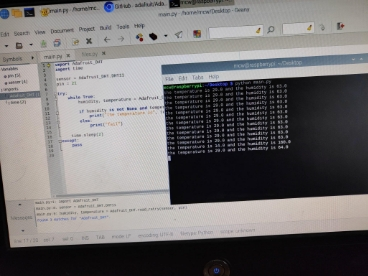



**MCW CLUSTER-3**

Task given:

Step1: Setup Raspberry Pi with a desktop and all necessary things.

Step2: Connect a temperature sensor to Raspberry Pi.

Step3: Try to learn how to develop to code with drivers that interacts with hardware.

Step4: To write a code, that reads the temperature from the sensor and prints it in the console.

Must know:

GPIO

I2C

SPI

The code for interfacing with the Raspberry Pi's GPIO pins and reading data from a sensor is typically written in a language like Python, C, or C++.

Python is a popular choice for beginners due to its simplicity and readability. There are libraries such as RPi. GPIO and GPIO Zero that make it easy to work with the GPIO pins.

C and C++ can also be used for low-level programming and interfacing with hardware. These languages provide more control over memory and hardware resources, making them suitable for more complex projects.

So based on the above suggestions, we trying to implement the given task in C++.

Outcome:- Successfully able to read and print the humidity and temperature readings in the console with the help of DTH11 sensor connected to the raspberry pi. The code was implemented in python.

Source Code:

import Adafruit\_DHT

sensor = Adafruit\_DHT.DHT22  

pin = 4 

def read\_temperature\_humidity():

`    `humidity, temperature = Adafruit\_DHT.read\_retry(sensor, pin)

`    `if humidity is not None and temperature is not None:

`        `return temperature, humidity

`    `else:

`        `print("Failed to retrieve data from sensor.")

`        `return None, None

temperature, humidity = read\_temperature\_humidity()

if temperature is not None and humidity is not None:

`    `print(f"Temperature: {temperature:.2f}°C")

`    `print(f"Humidity: {humidity:.2f}%")

**Adafruit Python DHT Sensor Library**

A python library provided by Adafruit Industries for interfacing with DHT series temperature and humidity sensors, such as DHT11, DHT22 (AM2302), and others. This library simplifies the process of reading data from these sensors on Raspberry Pi.

This library is written in python, c and c++.

Github repository - <https://github.com/adafruit/Adafruit_Python_DHT>

Currently we are trying to analyze this library (package) which is communicating with the temperature sensor from Raspberry pi.

